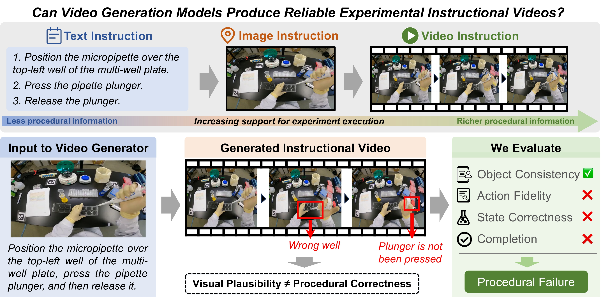

<!-- markdownlint-disable MD013 MD033 MD041 MD060 -->

<p align="center">
  
</p>

<h2 align="center">LabInstruct: Benchmarking Situated Instructional Video Generation for Lab Procedures</h2>

<div align="center">

🌐 [Homepage](https://csu-jpg.github.io/LabInstruct.github.io/) | 👉 [Dataset](https://huggingface.co/datasets/CSU-JPG/LabInstruct) | 📄 Paper (coming soon) | 💻 [Code](https://github.com/CSU-JPG/LabInstruct) | 🏆 [Leaderboard](#leaderboard)

</div>

<a id="updates"></a>

## 📢 Updates

- **[2026-09]** LabInstruct is online!

<a id="todo"></a>

## 📝 TODO

- [x] Release the annotation data: 204 task specifications, 204 QA checklists, 81 source clip-boundary annotations, and source-video links.
- [x] Release the code: data preparation, video generation, and evaluation harness.

<a id="table-of-contents"></a>

## 📑 Table of Contents

- [📜 Abstract](#abstract)
- [🌟 Project Overview](#project-overview)
- [🚀 Setup](#setup)
- [🗂 Repository Structure](#repository-structure)
- [🏆 Leaderboard](#leaderboard)
- [🎓 BibTeX](#bibtex)
- [📧 Contact](#contact)
- [🙏 Acknowledgements](#acknowledgements)

<a id="abstract"></a>

## 📜 Abstract

Self-driving laboratories (SDLs) aim to automate the full experimental loop, from scientific decision-making to physical execution. Ideally, AI-generated plans could be carried out directly by robotic systems, but reliable automation remains difficult in complex, open-world laboratory environments, where experiments often involve fine-grained manipulation, long-horizon procedures, and substantial variation across tasks and setups. Humans therefore remain an important execution interface between AI-generated plans and physical experiments, creating a need for clear and effective human-facing experimental guidance. Because laboratory procedures are inherently visual, spatial, and dynamic, video is particularly well suited to communicating apparatus configurations, manipulation actions, temporal dependencies, and state changes. Recent advances in video generation now make it possible to synthesize experimental demonstrations directly from an initial workspace image and a natural-language instruction. However, whether such models can reliably communicate real laboratory procedures has not been systematically studied. We introduce **LabInstruct**, a benchmark for situated instructional video generation in real laboratories. LabInstruct contains 204 tasks across 5 scientific disciplines, with real reference executions and structured annotations of objects, actions, contacts, and state transitions. Evaluating 8 frontier image-to-video models, we find that visually plausible generations frequently remain procedurally incorrect, revealing a substantial gap between visual realism and the reliability required for experimental instruction.

<a id="project-overview"></a>

## 🌟 Project Overview

<p align="center">
  
</p>

<p align="center"><strong>Figure 1.</strong> LabInstruct evaluates generated laboratory videos for procedural correctness beyond visual plausibility.</p>

<a id="setup"></a>

## 🚀 Setup

### 1. Environment setup

Python 3.10 or newer is required. Install `ffmpeg` and `ffprobe` for media reconstruction and video evaluation.

```bash
python -m venv .venv
source .venv/bin/activate
pip install -e .
```

Optional dependencies:

```bash
pip install -e ".[diffusers]"
pip install -e ".[qa]"
```

### 2. Prepare benchmark data

Place legally obtained source videos under `data/source_videos/`, using the `source_video_id` names in `data/video_sources.csv`.

```bash
python scripts/prepare_data.py --check
python scripts/prepare_data.py --clips --first-frames
python scripts/specs_to_tasks.py
```

### 3. Generate videos

Configure model environments and checkpoints in `bench/models.yaml`, then run:

```bash
python -m bench.cli gen \
  --run exp1 \
  --models wan2.2,ltx2.3,minimax-h3 \
  --gpus 0,1,2,3
```

### 4. Evaluate videos

```bash
export JUDGE_API_BASE_URL="https://your-endpoint.example/v1"
export GPT_API_TOKEN="your-token"

python scripts/judge_videos_gpt.py --model-name all --fps 4
```

<a id="repository-structure"></a>

## 🗂 Repository Structure

```text
.
├── bench/
│   ├── adapters/               model-specific generation adapters
│   ├── core/                   dispatch and GPU allocation
│   ├── eval/                   evaluation schema and prompt rendering
│   └── models.yaml             model registry and generation settings
├── data/
│   ├── video_sources.csv       source-video provenance and URLs
│   ├── specs/                  task specifications (2 examples; 204 in total)
│   ├── checklists/             QA checklists (2 examples; 204 in total)
│   ├── source_annotations/     source clip boundaries (81 source videos)
│   ├── rules/                  annotation and evaluation prompts
│   ├── human_eval/             human-rating interface
│   ├── source_videos/          source videos (not distributed; see below)
│   ├── video_clips/            task clips rebuilt by prepare_data.py
│   └── first_frames/           first frames rebuilt by prepare_data.py
├── scripts/
│   ├── prepare_data.py         rebuild clips and first frames
│   ├── specs_to_tasks.py       export harness-ready tasks
│   ├── generate_qas.py         draft QA checklists
│   └── judge_videos_*.py       evaluate generated videos
├── assets/                     README figures
└── pyproject.toml              package metadata and dependencies
```


> [!IMPORTANT]
> This repository ships two example tasks. The complete set of 204 task specifications and 204 QA checklists is released as a dataset on [Hugging Face](https://huggingface.co/datasets/CSU-JPG/LabInstruct). LabInstruct releases links and annotations only. Third-party source videos, extracted clips, and first frames must be obtained or reconstructed under their original terms.

<a id="leaderboard"></a>

## 🏆 Leaderboard

Pooled Overall is evaluated by GPT-5.6 Sol at 4 FPS. Higher is better; † marks commercial models.

| Rank | Model | Type | Organization | Pooled Overall |
| :--: | :-- | :-- | :-- | --: |
| **1** | **MiniMax H3** | Open weight | MiniMax | **46.3** |
| 2 | Seedance 2.0 † | Commercial | ByteDance | 45.1 |
| 3 | Wan 3.0 † | Commercial | Alibaba | 44.4 |
| 4 | Wan 2.2-I2V-A14B | Open weight | Alibaba | 25.9 |
| 5 | Cosmos3 Super | Open weight | NVIDIA | 22.8 |
| 6 | LTX 2.3 | Open weight | Lightricks | 22.1 |
| 7 | LingBot Video | Open weight | Robbyant | 19.5 |
| 8 | Cosmos3 Nano | Open weight | NVIDIA | 19.4 |

<a id="bibtex"></a>

## 🎓 BibTeX

If you find our work helpful, please consider citing it:

```bibtex
@misc{fu2026labinstruct,
  title         = {LabInstruct: Benchmarking Situated Instructional Video Generation for Lab Procedures},
  author        = {Yuming Fu and Weijia Wu and Jing Chen and Jiahao Tang and Feifei Chen and Hongyu Zhu and Xin Jin and Alex Jinpeng Wang},
  year          = {2026},
  eprint        = {XXXX.XXXXX},
  archivePrefix = {arXiv},
  primaryClass  = {cs.CV},
  url           = {https://arxiv.org/abs/XXXX.XXXXX}
```

<a id="contact"></a>

## 📧 Contact

For questions, please open an issue in this repository or email Yuming Fu at [yumingfu@csu.edu.cn](mailto:yumingfu@csu.edu.cn).

<a id="acknowledgements"></a>

## 🙏 Acknowledgements

We thank the creators of the source videos and the authors of FineBio, ExpVid, and the evaluated video-generation models for their work.
